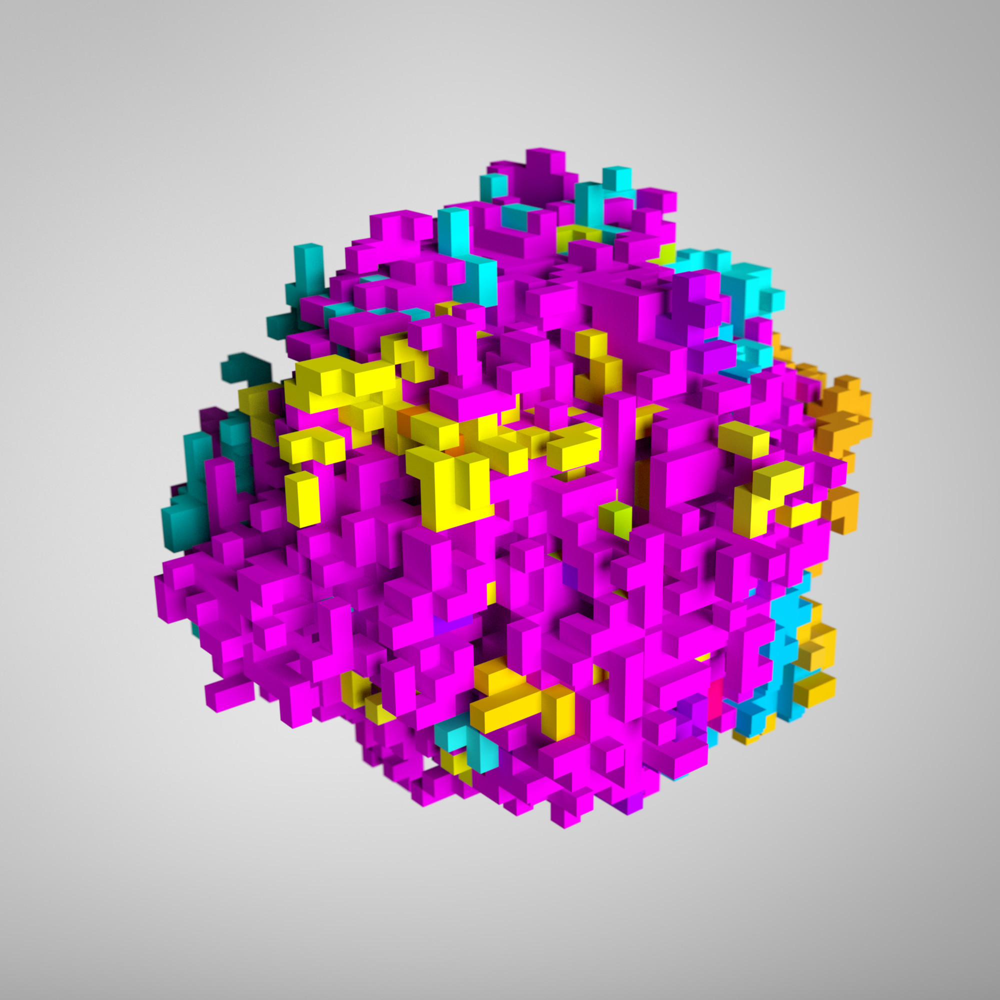
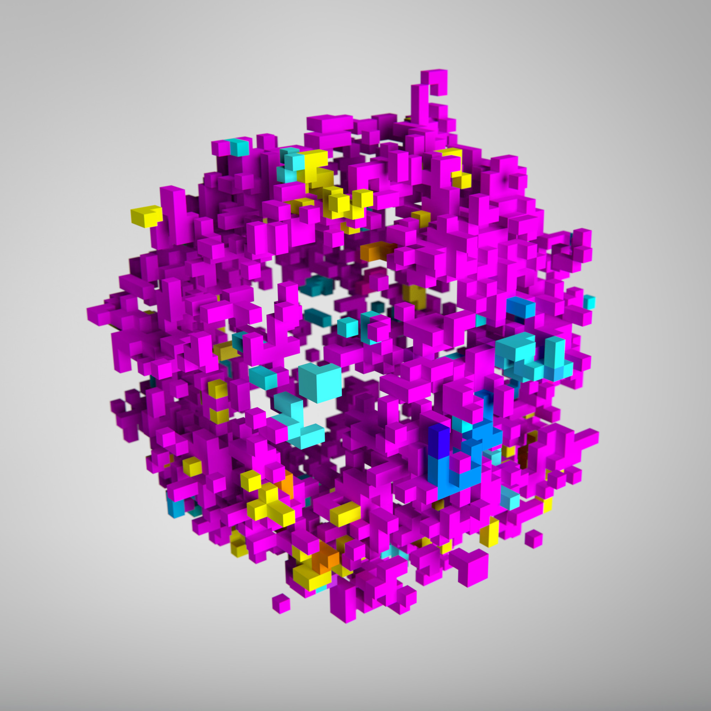
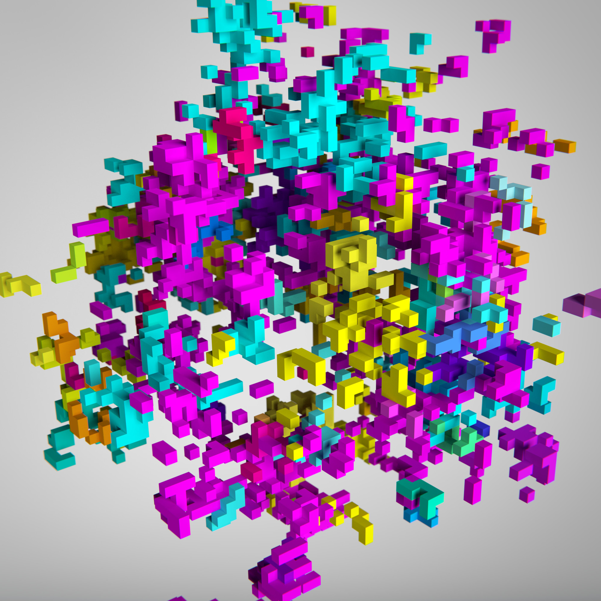
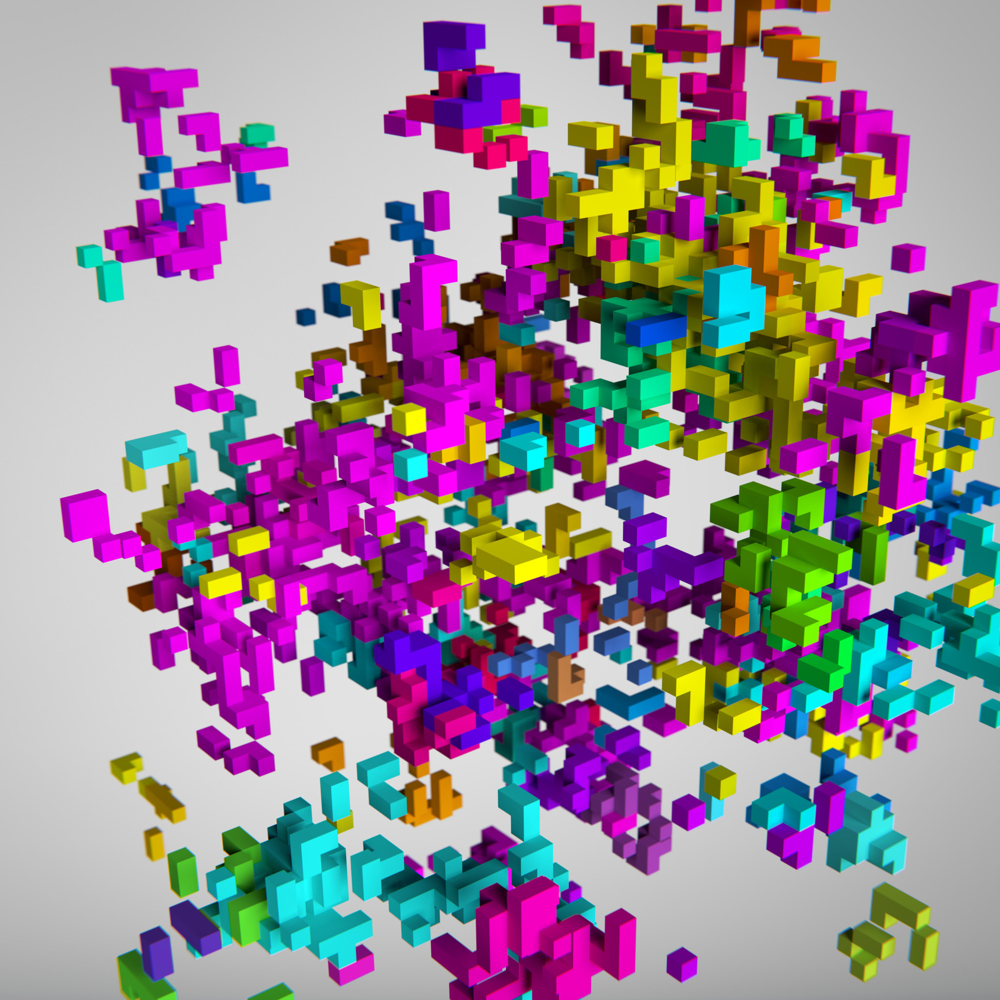
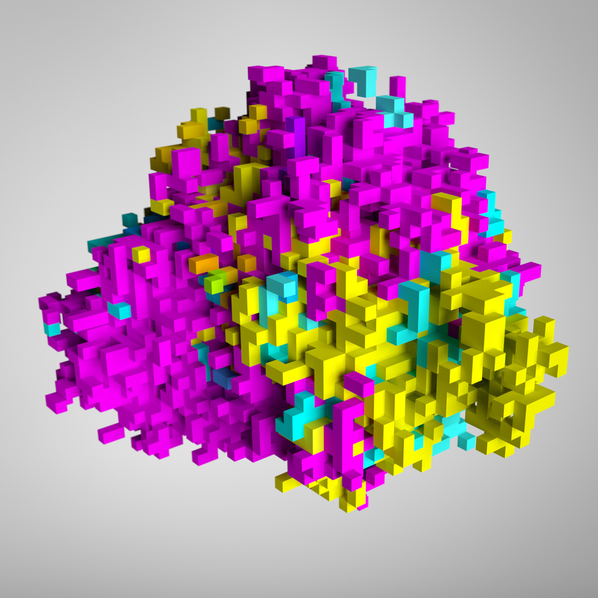
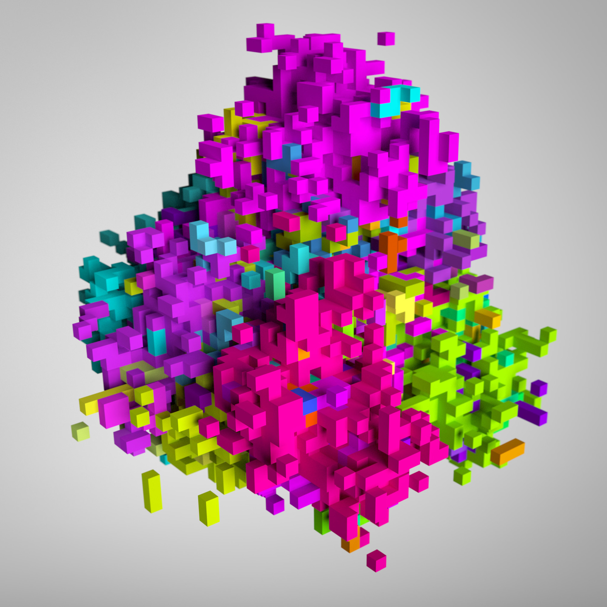
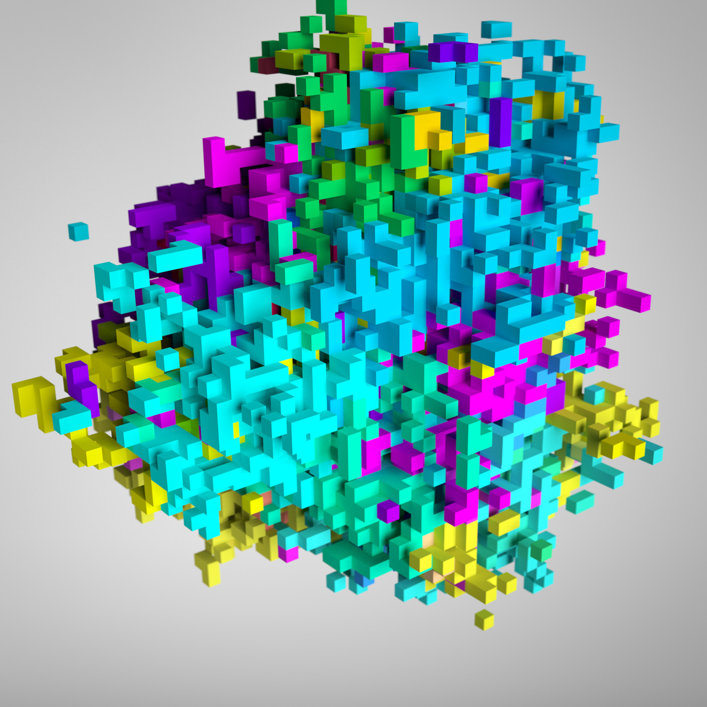

# Brittle Bits

Enveloped by the intricate electronic fabric of modern life, we often take for granted the myriad of digital systems that keep us safe, informed, and connected. From fire alarms to internet servers to the national power grid, we trust that these nearly-invisible systems are robust enough to uphold our civic infrastructure.

That is, until they break.

Unfortunately, many systems that we come to rely on are fragile and error-prone. An entire computer system can crash at the fault of a single component. More commonly, errors arise out of the opaque, often mysterious workings of code. Brittle Bits seeks to visualize software misbehavior propagating across biologically-inspired systems.

[Read the Writeup](BrittleBits.pdf)

---

Assignment for: 4.101 Exploring Design

Learning Focus: Emergent Systems, Fragile Programming, Genetic Algorithms, Simulation, 3D Rendering

Media: 3D Render, Simulation, Computer Graphic

Software: Processing, Java, Blender

Date: Feb 2016
